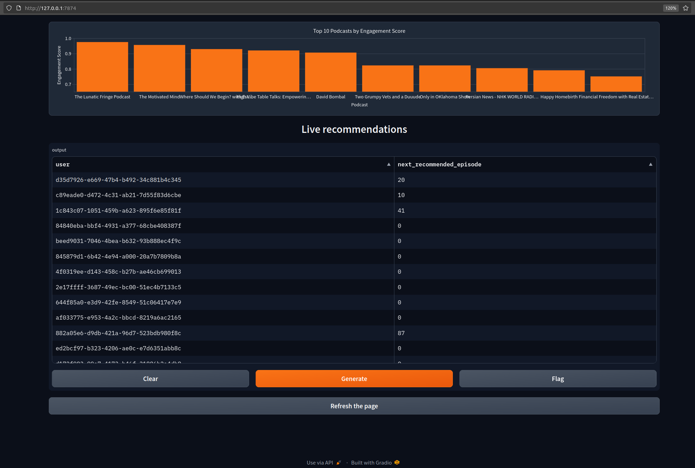

# **System Dashboard**

This branch contains a basic dashboard to display the outputs of the podcast recommendation system. In the architecture diagram, this corresponds to "analytics on audience engagement".

The dashboard is based on [Gradio](https://www.gradio.app/), a Python library to quickly build basic apps. It display a barplot of the top-k podcasts (as ranked by user engagement) and a table of live recommendations, which stores user IDs in one column and the recommendation IDs in the other:

In this first version of the dashboard, data on trending episodes are taken from `top_episodes.json`, user IDs are generated at random, and recommendations are read from an external `.csv` (which shall be replaced by the Mongo record in the final version).

To the best of my knowledge, there is no way to continuously stream data to a dataframe with Gradio (streaming is available only for audio and video data). I worked around this by including a `Refresh` button in the dashboard: every time a user hits the button, recommendations are updated in the dashboard. It is possible to hit the button programmatically with JavaScript (cf. [here](https://github.com/gradio-app/gradio/issues/7713)) to make the dashboard entirely automatic. I left this for the fine-tuning phase. 